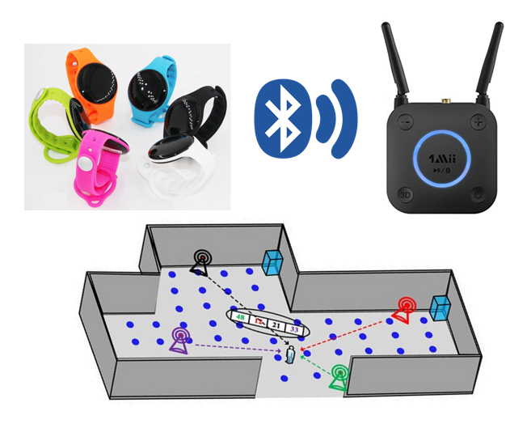

# IP
<h3>IP use case</h3>
 

<h3>For a correct display of the html code present in the notebook it is better to view it by this link:</h3>
https://nbviewer.jupyter.org/github/riccardosaruis/IP/tree/main/?flush_cache=true/
 

<figure>

<figcaption>Img.4: Indoor Positioning</figcaption>
</figure>
